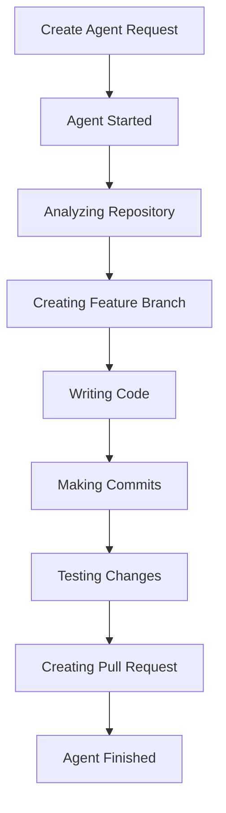

# 🤖 Cursor Background Agent MCP Server

A powerful Model Context Protocol (MCP) server that integrates with the Cursor Background Agent API, enabling programmatic creation and management of AI-powered autonomous coding agents with a comprehensive web interface.

## 🚀 Features

- **🔧 Complete MCP Server**: Full integration with Cursor Background Agent API
- **🌐 Advanced Web Interface**: Beautiful, responsive web frontend with dual-mode operation
- **📋 Agent Management Dashboard**: Default view showing all existing agents with detailed information
- **➕ On-Demand Agent Creation**: Switch to creation mode when needed
- **⚡ Real-time Monitoring**: Track agent progress, status, and completion
- **🔄 Dynamic Data Loading**: Auto-populate models, repositories, and branches
- **📊 Comprehensive Agent Details**: View agent summaries, target branches, and creation dates
- **🎯 Smart Caching**: Efficient API usage with intelligent caching
- **🛡️ Secure**: Proper authentication and error handling
- **📱 Responsive**: Modern web interface that works on all devices

## 📋 Prerequisites

- Python 3.8+
- Valid Cursor API key from [Cursor Integrations](https://cursor.com/integrations)
- Git access to target repositories

## 🛠️ Quick Start

### 1. Install Dependencies

```bash
# Make setup script executable and run it
chmod +x setup_cursor_mcp.sh
./setup_cursor_mcp.sh
```

### 2. Configure API Key

```bash
# Set your Cursor API key
export CURSOR_API_KEY="your_cursor_api_key_here"
```

### 3. Start the Web Interface

```bash
# Start the web configuration server
chmod +x start_web_config.sh
./start_web_config.sh
```

### 4. Use the Web Interface

1. Open http://localhost:8080 in your browser
2. **Default View**: See all your existing agents with detailed information
3. **Create New Agent**: Click "➕ Create New Agent" to switch to creation mode
4. **Dynamic Configuration**: Use "Update" buttons to load available models, repositories, and branches
5. **Agent Management**: View agent progress, check PRs, and manage running agents

## 🎯 Available AI Models

- `claude-4-sonnet` - Best overall performance (recommended)
- `claude-4-opus` - Maximum capability for complex tasks
- `gpt-5` - Latest GPT model
- `gpt-5-fast` - Optimized for speed
- `o3` - Advanced reasoning model

## 📁 Project Structure

```
CodeMCP/
├── cursor_agent_mcp_server.py      # Core MCP server implementation
├── cursor_config_server.py         # Web backend (FastAPI)
├── cursor_config_web.html          # Web frontend interface
├── cursor_mcp_requirements.txt     # Python dependencies
├── cursor_mcp_config.json          # MCP server configuration
├── setup_cursor_mcp.sh             # Automated setup script
├── start_web_config.sh             # Web server startup script
├── example_cursor_mcp_client.py    # Example MCP client usage
├── create_agent_example.py         # Direct API usage example
└── README.md                       # This file
```

## 🔧 Configuration

### Environment Variables

```bash
# Required
CURSOR_API_KEY=your_api_key_here

# Optional
CURSOR_API_BASE_URL=https://api.cursor.com  # Default API base URL
LOG_LEVEL=INFO                               # Logging level
MCP_SERVER_NAME=cursor-background-agent-mcp # Server name
MCP_SERVER_VERSION=1.0.0                    # Server version
```

### MCP Server Configuration

Edit `cursor_mcp_config.json` to customize:

```json
{
  "name": "cursor-background-agent-mcp",
  "version": "1.0.0",
  "capabilities": {
    "tools": true,
    "resources": true,
    "prompts": true
  },
  "logging": {
    "level": "INFO"
  }
}
```

## 🛠️ MCP Tools Available

### Agent Management
- `cursor_create_background_agent` - Create new autonomous coding agents
- `cursor_get_agent_status` - Check agent progress and status
- `cursor_list_background_agents` - List all your agents
- `cursor_stop_background_agent` - Stop/delete running agents

### Agent Interaction
- `cursor_add_followup_instruction` - Send additional instructions to running agents
- `cursor_get_agent_conversation` - View agent conversation logs

### System Information
- `cursor_get_api_usage` - Check API usage and limits
- `cursor_list_available_models` - Get available AI models
- `cursor_list_repositories` - List accessible repositories

## 🌐 Web Interface Usage

### Agent Management Dashboard (Default View)

The interface opens to a comprehensive agent management dashboard showing:

- **📋 Agent List**: All your existing agents with detailed information
- **🔄 Refresh Button**: Update agent status and information
- **📊 Agent Details**: Name, repository, branches, summary, creation date
- **⚡ Quick Actions**: View agent progress, check PRs, stop agents
- **🎯 Status Indicators**: Color-coded status badges (RUNNING, COMPLETED, FAILED, etc.)

### Creating New Agents

Switch to creation mode by clicking "➕ Create New Agent":

1. **📂 Repository Selection**: 
   - Enter GitHub repository URL manually, OR
   - Click "🔄 Update Repos" to load your accessible repositories
   - Select from dropdown for easy access
2. **🧠 AI Model Selection**:
   - Click "🔄 Update Models" to load available models
   - Choose from Claude, GPT, and other models
3. **🌿 Target Branch**:
   - Click "🔄 Update Branches" to load repository branches
   - Select existing branch or create new one
4. **📝 Task Description**: Describe what you want the agent to build
5. **🚀 Create Agent**: Launch the autonomous coding agent

### Dynamic Data Loading

The interface intelligently loads data from the Cursor API:

- **🤖 Models**: Real-time list of available AI models
- **📁 Repositories**: Your accessible GitHub repositories
- **🌿 Branches**: Live branch information from GitHub
- **💾 Smart Caching**: Data persists across page refreshes
- **⚡ Efficient Updates**: Only refresh when needed

## 📊 Agent Workflow



## 🔍 Example Usage

### Python MCP Client

```python
import asyncio
from cursor_agent_mcp_server import CursorAgentMCPServer, CursorApiConfig

async def create_agent():
    config = CursorApiConfig(api_key="your_api_key")
    server = CursorAgentMCPServer(config)
    
    result = await server._create_background_agent({
        'repository_url': 'https://github.com/your-org/your-repo',
        'prompt': 'Add user authentication with JWT tokens',
        'branch': 'main',
        'model': 'claude-4-sonnet'
    })
    
    print(f"Agent created: {result['agent_id']}")

asyncio.run(create_agent())
```

### Direct Web API

```javascript
// Create agent via web API
fetch('http://localhost:8080/api/create-agent', {
    method: 'POST',
    headers: { 'Content-Type': 'application/json' },
    body: JSON.stringify({
        repository_url: 'https://github.com/your-org/your-repo',
        prompt: 'Build a REST API with authentication',
        model: 'claude-4-sonnet'
    })
})
.then(response => response.json())
.then(data => console.log('Agent created:', data.agent_id));
```

## 🧪 Testing

The project includes a test script to verify the MCP server functionality and API connectivity.

### Running Tests

```bash
# Ensure your API key is set
export CURSOR_API_KEY="your_cursor_api_key_here"

# Run the test script
python3 test_cursor_mcp.py
```

### What Gets Tested

The test script validates:

- **✅ Server Initialization**: Verifies the MCP server starts correctly
- **✅ API Connection**: Tests connectivity to the Cursor API
- **✅ Configuration**: Validates API key and configuration settings
- **📊 Usage Data**: Retrieves and displays your API usage information

### Expected Output

Successful test run:
```
🧪 Testing Cursor Agent MCP Server...
✅ Server initialization successful
✅ API connection successful
📊 Usage data: {
  "success": true,
  ...
}
```

Failed test run:
```
❌ CURSOR_API_KEY not set
```
or
```
❌ Test failed: [error message]
```

### Prerequisites for Testing

- Python 3.8+
- Valid `CURSOR_API_KEY` set in environment
- Dependencies installed (`pip install -r cursor_mcp_requirements.txt`)
- Internet connectivity to reach Cursor API

### Using with dotenv

The test script supports `.env` files for easier configuration:

```bash
# Create .env file
cp env.example .env

# Edit with your API key
echo "CURSOR_API_KEY=your_api_key_here" > .env

# Run tests (will auto-load .env)
python3 test_cursor_mcp.py
```

## 🔧 Advanced Configuration

### Custom Webhooks

Set up webhooks to receive real-time notifications:

```python
# Configure webhook in your MCP server
config = CursorApiConfig(
    api_key="your_api_key",
    webhook_url="https://your-domain.com/webhook"
)
```

### Batch Agent Creation

```python
# Create multiple agents for different tasks
agents = []
tasks = [
    "Add user authentication",
    "Implement payment processing", 
    "Create admin dashboard"
]

for task in tasks:
    agent = await server._create_background_agent({
        'repository_url': 'https://github.com/your-org/your-repo',
        'prompt': task,
        'model': 'claude-4-sonnet'
    })
    agents.append(agent['agent_id'])
```

## 🚨 Troubleshooting

### Common Issues

**Agent Creation Fails**
- Verify your API key is valid and has write permissions
- Ensure the repository exists and you have access
- Check that the target branch exists

**No Code Generated**
- Wait 2-3 minutes for GitHub sync
- Check the agent status with `cursor_get_agent_status`
- Verify the agent hasn't encountered errors

**Web Interface Not Loading**
- Ensure port 8080 is available
- Check that all dependencies are installed
- Verify the virtual environment is activated

### Debug Mode

```bash
# Run with debug logging
export LOG_LEVEL=DEBUG
./start_web_config.sh
```

## 📚 API Reference

### Core Endpoints

| Method | Endpoint | Description |
|--------|----------|-------------|
| POST | `/api/create-agent` | Create a new background agent |
| GET | `/api/agent-status/{id}` | Get agent status |
| GET | `/api/agents` | List all agents with pagination |
| POST | `/api/agent/{id}/followup` | Add follow-up instruction |
| DELETE | `/api/agent/{id}` | Stop/delete agent |
| GET | `/api/models` | Get available AI models |
| GET | `/api/repositories` | Get accessible repositories |
| GET | `/api/branches` | Get repository branches |

### MCP Resources

- `mcp://cursor-agent/config` - Server configuration
- `mcp://cursor-agent/agents` - Active agents list
- `mcp://cursor-agent/models` - Available models
- `mcp://cursor-agent/repositories` - Accessible repositories

## 🤝 Contributing

1. Fork the repository
2. Create a feature branch
3. Make your changes
4. Add tests if applicable
5. Submit a pull request

## 📄 License

This project is licensed under the MIT License - see the LICENSE file for details.

## 🙏 Acknowledgments

- Built for the [Cursor](https://cursor.com) Background Agent API
- Uses the [Model Context Protocol (MCP)](https://modelcontextprotocol.io)
- Powered by [FastAPI](https://fastapi.tiangolo.com) and modern web technologies

---

## 🆕 Latest Features

### Agent Management Dashboard
- **Default View**: Opens directly to your agent management dashboard
- **Real-time Status**: See all agents with current status and progress
- **Detailed Information**: View agent names, repositories, branches, summaries, and creation dates
- **Quick Actions**: Direct links to view agents in Cursor, check PRs, and stop agents

### Dynamic Data Loading
- **Smart Dropdowns**: Auto-populate models, repositories, and branches from APIs
- **Intelligent Caching**: Data persists across page refreshes for better performance
- **Rate Limit Handling**: Efficient API usage with built-in caching and retry logic
- **Real-time Updates**: Refresh data when needed with "Update" buttons

### Enhanced User Experience
- **Dual-Mode Interface**: Switch between agent management and creation modes
- **Responsive Design**: Works perfectly on desktop, tablet, and mobile devices
- **Status Indicators**: Color-coded badges for easy status identification
- **Persistent Data**: Form data and selections survive page refreshes

## 🎯 What This System Enables

With this MCP server, you can:

- **🤖 Create Autonomous Coding Agents** that work independently on your repositories
- **🌐 Use an Advanced Web Interface** with dual-mode operation for management and creation
- **📊 Track Real-time Progress** as agents write code and make commits
- **🔄 Manage Multiple Projects** with different agents working simultaneously
- **⚡ Integrate with Any Application** using the MCP protocol
- **🛡️ Maintain Security** with proper authentication and error handling
- **📋 Monitor All Agents** from a centralized dashboard with detailed information
- **🎯 Dynamic Configuration** with smart data loading and caching

**Transform your development workflow with AI agents that code autonomously!** 🚀
